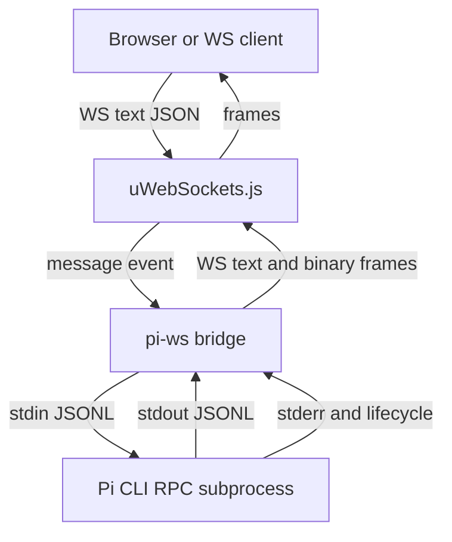

# pi-ws

[](https://www.npmjs.com/package/pi-ws)
[](https://www.npmjs.com/package/pi-ws)
[](https://www.npmjs.com/package/pi-ws)
[](https://github.com/SkeLLLa/pi-ws/actions)
[](https://github.com/SkeLLLa/pi-ws/blob/master/LICENSE)
[](https://codecov.io/gh/SkeLLLa/pi-ws)
[](https://socket.dev/npm/package/pi-ws)

Embeddable Node.js WebSocket bridge for running local
[`pi`](https://www.npmjs.com/package/@earendil-works/pi-coding-agent) coding
agent RPC sessions from browsers, internal tools, dashboards, and custom
automation.

`pi-ws` is library-first: you embed `PiWs` in your own Node.js process, keep
control over auth and routes, and get a built-in `/ws/pi` bridge that starts one
local Pi subprocess per WebSocket connection.

```text
browser/client  ── WebSocket JSON ──▶  pi-ws  ── JSONL stdin/stdout ──▶  pi --mode rpc
```

## Features

- Built-in Pi RPC WebSocket route at `/ws/pi`.
- Library extension points for custom HTTP routes, WebSocket routes, and direct
  `uWebSockets.js` installers.
- Optional hook-based auth; no authentication is enabled unless you add hooks or
  opt into the reference token hook.
- Reference shared-token auth for WebSocket and HTTP helpers.
- Artifact transfer for generated files, enabled by default.
- Binary WebSocket streaming for images, PDFs, CSVs, text, archives, audio,
  video, and other agent-created files.
- Per-session process sandbox workspace with reduced environment by default.
- Optional external system sandbox wrapper such as `bwrap` or `firejail`.
- `c12`-based config loading for binaries and deployments.
- Structured `pino` logs and example launchers with `pino-pretty`.
- TypeScript-first public API.

## Installation

```bash
pnpm add pi-ws
```

```bash
npm install pi-ws
```

Node.js `>=22.19.0` is required.

## Documentation

- [Getting started](docs/GETTING_STARTED.md) - prerequisites, first server, and
  first WebSocket message.
- [Examples](examples/README.md) - runnable browser chat, provider keys, auth,
  artifacts, and sandbox directories.
- [Security guide](docs/SECURITY.md) - threat model, auth, sandbox limits, and
  deployment checklist.
- [Contributing guide](docs/CONTRIBUTING.md) - local setup, test commands,
  generated docs, and pull request expectations.
- [API reference](docs/api/index.md) - generated TypeScript API docs.

## Quick Start

```ts
import { PiWs } from 'pi-ws';

const pipe = new PiWs({
  host: '127.0.0.1',
  port: 8787,
  chatExample: false,
});

pipe.handle({
  method: 'get',
  path: '/health/application',
  handler: (res) => {
    res
      .writeHeader('content-type', 'application/json')
      .end(JSON.stringify({ ok: true }));
  },
});

await pipe.listen();
```

The built-in Pi bridge is available at:

```text
ws://127.0.0.1:8787/ws/pi
```

Clients send Pi RPC JSON objects as WebSocket text frames. `pi-ws` validates
each frame as a JSON object, forwards it to Pi as JSONL, parses Pi stdout back
to JSON objects, and sends responses back as WebSocket text frames.

## Auth Is Opt-In

`pi-ws` does not implement mandatory server auth and does not enable auth by
default. Applications decide how to protect the route using hooks, reverse
proxies, network policy, or their existing auth stack.

The package includes a small token-based reference implementation for projects
that want a simple built-in option:

```ts
import { createStaticTokenAuthHook, PiWs } from 'pi-ws';

const pipe = new PiWs();

pipe.addHook(
  'onAuth',
  createStaticTokenAuthHook({
    token: process.env.PI_WS_AUTH_TOKEN ?? 'change-me',
    queryParam: 'token',
    createSession: async (request) => ({
      clientAddress: request.remoteAddress ?? 'unknown',
    }),
  }),
);

await pipe.listen();
```

Browser clients that cannot send custom WebSocket upgrade headers can
authenticate with the reserved first message:

```json
{ "token": "change-me", "type": "pi_ws_auth" }
```

For HTTP routes, use the same token policy with `protectHttpHandler()`:

```ts
import { protectHttpHandler, StaticTokenAuthorizer } from 'pi-ws';

const authorize = new StaticTokenAuthorizer({
  token: 'change-me',
  queryParam: 'token',
}).authorize;

pipe.handle({
  method: 'get',
  path: '/api/private',
  handler: protectHttpHandler({
    authorize,
    handler: (res) => {
      res.end('ok');
    },
  }),
});
```

## Artifacts

Artifacts are enabled by default. Each WebSocket session gets a private
artifact directory under the configured artifact root, and the Pi subprocess
receives the full path through `PI_WS_ARTIFACT_DIR`.

The browser does not need the absolute server path. The ready event exposes
safe status only:

```json
{
  "artifactDirName": "s-8588573f292b",
  "artifactsEnabled": true,
  "sandboxMode": "process",
  "type": "pi_ws_ready"
}
```

`artifactDirName` is only the last directory name, not the full path.

Small files are sent as one metadata frame plus one binary frame:

1. `pi_ws_artifact`
2. binary file bytes

Large files are sent as chunk metadata plus binary frames:

1. `pi_ws_artifact_start`
2. repeated `pi_ws_artifact_chunk`
3. one binary frame per chunk
4. `pi_ws_artifact_end`

Example config:

```ts
const pipe = new PiWs({
  artifacts: {
    enabled: true,
    dir: './.pi-ws/artifacts',
    maxFileBytes: 25 * 1024 * 1024,
    chunkSizeBytes: 256 * 1024,
    logLevel: 'info',
    logFile: './.pi-ws/pi-ws.log',
  },
});
```

Generated files are discovered after they are stable on disk. Symlinks and
paths outside the artifact root are ignored.

## Sandbox And Environment

The default sandbox mode is `process`. It creates one session root under
`sandbox.cwd` and places cwd, `HOME`, and `TMPDIR` inside that root. This is
process-level isolation and prompt guidance, not an OS security boundary.

```ts
const pipe = new PiWs({
  sandbox: {
    mode: 'process',
    cwd: './.pi-ws/sandbox',
    envPolicy: 'minimal',
    allowReadDirs: ['./inputs'],
    allowWriteDirs: ['./scratch'],
    denyServerDirectory: true,
  },
});
```

Use `system` mode when you need OS-enforced isolation:

```ts
const pipe = new PiWs({
  sandbox: {
    mode: 'system',
    command: 'bwrap',
    args: [
      '--ro-bind',
      '{allowReadDirs}',
      '--bind',
      '{allowWriteDirs}',
      '--chdir',
      '{sandboxCwd}',
    ],
  },
});
```

`envPolicy: "minimal"` forwards only a small provider-focused allowlist plus
`sandbox.envAllowlist`. Explicit `sandbox.env` values remain the supported way
to pass application-specific tool configuration, but protected sandbox
variables such as `HOME`, `TMPDIR`, and `PI_WS_SANDBOX_CWD` stay controlled by
the bridge.

## Library API

`PiWs` keeps the extension surface intentionally small:

- `handle()` adds HTTP routes.
- `route()` adds WebSocket routes.
- `use()` installs low-level `uWebSockets.js` handlers.
- `addHook('onRequest', hook)` runs pre-upgrade checks for `/ws/pi`.
- `addHook('onAuth', hook)` authenticates `/ws/pi` from upgrade metadata or the
  reserved first WebSocket message.
- `configurePi()`, `configureArtifacts()`, `configureSandbox()`, and
  `configureTls()` merge focused runtime config.

Generated API docs:

- [API index](docs/api/index.md)
- [Package overview](docs/api/pi-ws.md)

## Binary Usage

The `pi-ws` binary is a thin wrapper around the library:

```ts
import { loadConfig, PiWs } from 'pi-ws';

const config = await loadConfig();
const pipe = new PiWs(config);
await pipe.listen();
```

Run after installation:

```bash
pi-ws
```

Configuration is resolved in this order:

1. explicit `loadConfig({ overrides })` values
2. `PI_WS_*` environment variables
3. `pi-ws.config.*` files in the current working directory
4. the `pi-ws` field in `package.json`
5. built-in defaults

Example `pi-ws.config.ts`:

```ts
import { definePiWsConfig } from 'pi-ws';

export default definePiWsConfig({
  host: '127.0.0.1',
  port: 8787,
  pi: {
    provider: 'openai',
    model: 'gpt-4.1',
  },
});
```

## Environment Variables

Core server:

- `PI_WS_HOST` - bind host, default `127.0.0.1`
- `PI_WS_PORT` - bind port, default `8787`
- `PI_WS_PREFIX` - WebSocket prefix, default `/ws`
- `PI_WS_MAX_PAYLOAD_BYTES` - max inbound frame size

Reference token auth:

- `PI_WS_AUTH_TOKEN` - enables the reference token auth hook for `/ws/pi`
- `PI_WS_AUTH_HEADER` - token header, default `authorization`
- `PI_WS_AUTH_SCHEME` - token scheme, default `Bearer`
- `PI_WS_AUTH_QUERY_PARAM` - optional query-string token parameter
- `PI_WS_AUTH_REALM` - optional `WWW-Authenticate` realm

Pi subprocess:

- `PI_WS_PI_COMMAND` - optional Pi command override
- `PI_WS_PI_ARGS` - whitespace args or JSON string array
- `PI_WS_PI_CWD` - optional Pi subprocess cwd
- `PI_WS_PI_AGENT_DIR` - optional `PI_CODING_AGENT_DIR`
- `PI_WS_PI_PROVIDER` - Pi provider
- `PI_WS_PI_MODEL` - model id or pattern
- `PI_WS_PI_THINKING` - thinking level
- `PI_WS_PI_NAME` - session display name
- `PI_WS_PI_SYSTEM_PROMPT` - replace Pi system prompt
- `PI_WS_PI_APPEND_SYSTEM_PROMPT` - string or JSON string array
- `PI_WS_PI_EXTENSIONS` - string or JSON string array
- `PI_WS_PI_PROMPT_TEMPLATES` - string or JSON string array

Artifacts:

- `PI_WS_ARTIFACTS_ENABLED` - enable/disable artifact transfer
- `PI_WS_ARTIFACTS_DIR` - artifact root
- `PI_WS_ARTIFACTS_MAX_FILE_BYTES` - max transfer size
- `PI_WS_ARTIFACTS_CHUNK_SIZE_BYTES` - binary chunk size
- `PI_WS_ARTIFACTS_SCAN_INTERVAL_MS` - discovery poll interval
- `PI_WS_ARTIFACTS_STABILITY_WINDOW_MS` - file stability window
- `PI_WS_ARTIFACTS_LOG_LEVEL` - pino log level
- `PI_WS_ARTIFACTS_LOG_FILE` - pino log destination

Sandbox:

- `PI_WS_SANDBOX_MODE` - `off`, `process`, or `system`
- `PI_WS_SANDBOX_CWD` - sandbox root
- `PI_WS_SANDBOX_ALLOW_READ_DIRS` - JSON string array
- `PI_WS_SANDBOX_ALLOW_WRITE_DIRS` - JSON string array
- `PI_WS_SANDBOX_ENV_POLICY` - `inherit`, `minimal`, or `allowlist`
- `PI_WS_SANDBOX_ENV_ALLOWLIST` - JSON string array
- `PI_WS_SANDBOX_ENV` - JSON object of explicit env values
- `PI_WS_SANDBOX_COMMAND` - external wrapper command for `system`
- `PI_WS_SANDBOX_ARGS` - wrapper args

TLS:

- `PI_WS_TLS_KEY_FILE` / `PI_WS_TLS_CERT_FILE` - enable HTTPS/WSS
- `PI_WS_TLS_CA_FILE` - optional CA bundle
- `PI_WS_TLS_PASSPHRASE` - optional private-key passphrase
- `PI_WS_TLS_DH_PARAMS_FILE` - optional DH params file
- `PI_WS_TLS_CIPHERS` - optional OpenSSL cipher suite override
- `PI_WS_TLS_PREFER_LOW_MEMORY_USAGE` - optional TLS memory tuning flag

## Examples

From this repository:

```bash
mise install
pnpm install
pnpm build
node examples/embedded-server.mjs
```

Open:

```text
http://127.0.0.1:8787/examples/chat/
```

The guided chat launcher:

```bash
pnpm example:chat
```

See [examples/README.md](examples/README.md) for provider keys, base URL
configuration, auth, artifact previews, and sandbox directories.

## Development

```bash
mise install
pnpm install
pnpm test
```

Useful scripts:

- `pnpm dev` - watch-mode binary entrypoint
- `pnpm demo` - run the local demo server
- `pnpm build` - build Node output and generated API docs
- `pnpm build:docs` - regenerate API docs
- `pnpm lint` - type, style, and dependency audit checks
- `pnpm test` - lint and unit tests

## Architecture

Route registration order:

1. built-in `/healthz`
2. optional `/examples/chat/`
3. built-in `${wsPrefix}/pi`
4. user HTTP routes added with `handle()`
5. user WebSocket routes added with `route()`
6. low-level installers added with `use()`
7. final catch-all 404



## License

[MIT](LICENSE)
