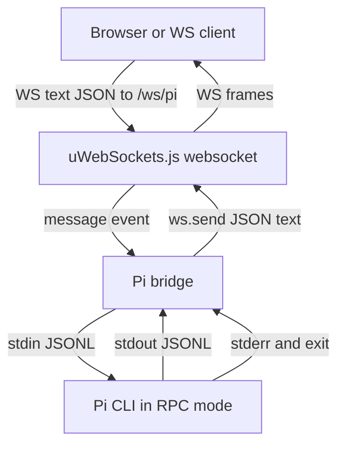

# pi-ws

Minimalistic, extendable server that exposes a local **pi** AI agent to the
internet over WebSocket. The pi agent runs on the same machine in RPC mode;
pi-ws bridges public WebSocket clients to it.

```
browser/client  ──ws──▶  pi-ws  ──rpc──▶  pi agent (rpc mode)
```

Default endpoint:

```text
ws://0.0.0.0:8787/ws/pi
```

Clients send pi RPC JSON objects as text WebSocket frames. pi-ws validates
each frame as a JSON object and forwards it to pi as one JSONL command. pi RPC
events and responses are forwarded back as JSON text frames. Bridge lifecycle
events use `pi_ws_*` event types.

## Requirements

- [mise](https://mise.jdx.dev/) (manages node + pnpm versions)

## Setup

```bash
mise install # installs node + pnpm from .mise.toml
pnpm install
```

## Scripts

- `pnpm dev` — watch-mode entrypoint (tsx)
- `pnpm demo` — run the server on `127.0.0.1:8787` with the chat example
- `pnpm build` — type-check + emit to `dist/`
- `pnpm start` — run built entrypoint
- `pnpm demo:built` — run the built server with the chat example
- `pnpm example:chat` — build and run the guided chat example launcher
- `pnpm build:docs` — generate API report + markdown docs into `docs/api/`
- `pnpm lint` — types + eslint + audit
- `pnpm test` — lint + unit tests

## API Docs

Generated API reference:

- [API index](docs/api/index.md)
- [Package overview](docs/api/pi-ws.md)

Regenerate it with:

```bash
pnpm build:docs
```

## Library Usage

`pi-ws` is library-first. Embed `PiWs`, add your routes, then listen:

```ts
import { PiWs } from 'pi-ws';

const pipe = new PiWs({
  host: '127.0.0.1',
  port: 8787,
});

pipe.handle('get', '/api/version', (res) => {
  res
    .writeHeader('content-type', 'application/json')
    .end(JSON.stringify({ version: 'local-dev' }));
});

pipe.route('/ws/echo', {
  message(ws, message, isBinary) {
    ws.send(message, isBinary);
  },
});

await pipe.listen();
```

The built-in Pi RPC route remains available at `/ws/pi`. Use `handle()` for
HTTP routes, `route()` for WebSocket routes, and `use()` for direct
`uWebSockets.js` access when needed.

For the full exported API surface, see [docs/api/pi-ws.md](docs/api/pi-ws.md).

### Run The Embedded Example

From this repository:

```bash
mise install
pnpm install
pnpm build
node examples/embedded-server.mjs
```

Then open:

```text
http://127.0.0.1:8787/examples/chat/
```

Or check the custom HTTP route:

```bash
curl http://127.0.0.1:8787/api/hello
```

When using `pi-ws` from another project:

```bash
pnpm add pi-ws
```

Create `server.mjs`:

```js
import { PiWs } from 'pi-ws';

const pipe = new PiWs({
  host: '127.0.0.1',
  port: 8787,
});

pipe.handle('get', '/api/hello', (res) => {
  res
    .writeHeader('content-type', 'application/json')
    .end(JSON.stringify({ hello: 'pi-ws' }));
});

await pipe.listen();
```

Run it:

```bash
node server.mjs
```

## Binary Usage

The `pi-ws` binary is a thin wrapper around the library:

```ts
const pipe = new PiWs();
await pipe.listen();
```

After installing the package, run:

```bash
pi-ws
```

From this repository, the equivalent binary-style commands are:

```bash
pnpm demo
```

or, after building:

```bash
pnpm build
pnpm demo:built
```

## Chat Example

The repository includes a minimal browser chat UI at `/examples/chat/`.
See [examples/README.md](examples/README.md) for detailed provider, API key,
model, proxy/base URL, and mise task instructions.

Normal launch:

```bash
pnpm demo
```

Then open:

```text
http://127.0.0.1:8787/examples/chat/
```

The page connects to:

```text
ws://127.0.0.1:8787/ws/pi
```

You do not need to launch Pi separately for this flow. pi-ws starts one
bundled Pi subprocess in RPC mode for each `/ws/pi` websocket connection:

```text
pi --mode rpc --no-session
```

To use a specific configured LLM provider/model, pass Pi arguments through
`PI_WS_PI_ARGS`:

```bash
PI_WS_PI_ARGS='["--no-session","--provider","openai","--model","openai/gpt-4.1"]' pnpm demo
```

Or use your configured Pi defaults:

```bash
PI_WS_PI_ARGS='["--no-session"]' pnpm demo
```

Optional Pi-only sanity check:

```bash
pnpm exec pi --mode rpc --no-session
```

Type a JSON command such as `{"type":"get_state"}` and press Enter. Exit with
`Ctrl+C`.

## Configuration

- `PI_WS_HOST` — bind host, default `0.0.0.0`
- `PI_WS_PORT` — bind port, default `8787`
- `PI_WS_PREFIX` — WebSocket prefix, default `/ws`
- `PI_WS_MAX_PAYLOAD_BYTES` — max inbound frame size, default `1048576`
- `PI_WS_PI_COMMAND` — optional pi command override; bundled pi is used by
  default
- `PI_WS_PI_ARGS` — extra pi args after `--mode rpc`; use whitespace
  separated args or a JSON string array
- `PI_WS_PI_CWD` — optional pi subprocess working directory

## Architecture

`pi-ws` keeps the server surface intentionally small:

- built-in HTTP route: `/healthz`
- built-in WebSocket route: `/ws/pi`
- optional built-in static example: `/examples/chat/`
- user extension points: `handle()`, `route()`, and `use()`

At runtime, each client connected to `/ws/pi` gets a dedicated local Pi
subprocess running in RPC mode. Incoming WebSocket text frames must be JSON
objects. `pi-ws` validates them, converts them to JSONL commands, and forwards
them to Pi over stdin. Pi stdout is read as UTF-8 JSONL, parsed back into JSON
objects, and sent to the client as WebSocket text frames. Pi stderr and bridge
lifecycle changes are exposed as `pi_ws_*` events.

Route registration order is:

1. built-in health route
2. optional built-in chat example routes
3. built-in Pi RPC websocket route
4. user HTTP routes added with `handle()`
5. user WebSocket routes added with `route()`
6. low-level installers added with `use()`
7. final catch-all 404 route



Example embedded usage:

```ts
import { PiWs } from 'pi-ws';

const pipe = new PiWs();

pipe.handle('get', '/api/version', (res) => {
  res
    .writeHeader('content-type', 'application/json')
    .end(JSON.stringify({ version: '1.0.0' }));
});

pipe.route('/ws/echo', {
  message(ws, message, isBinary) {
    ws.send(message, isBinary);
  },
});

pipe.use((app) => {
  app.get('/internal/ping', (res) => {
    res.end('pong');
  });
});

await pipe.listen();
```
