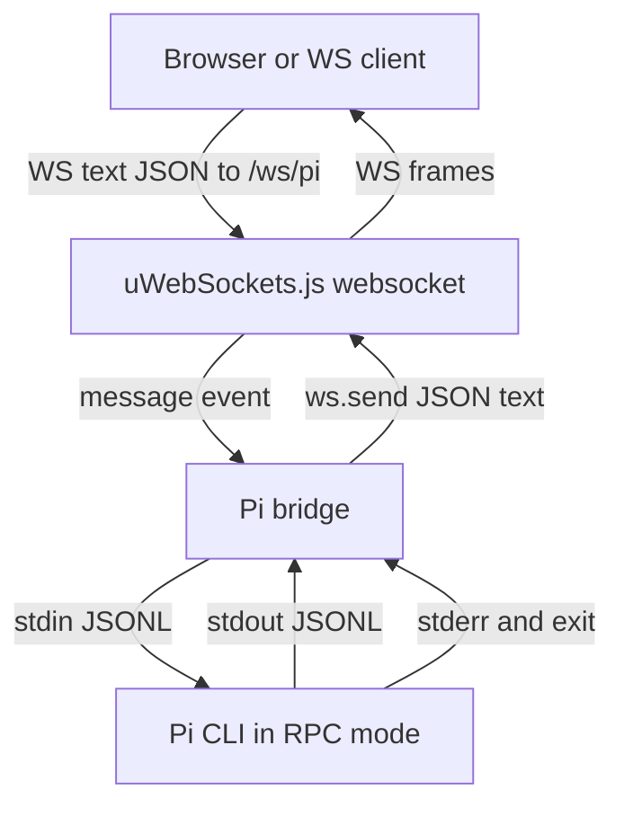

# pi-ws

Minimalistic, extendable server that exposes a local **pi** AI agent to the
internet over WebSocket. The pi agent runs on the same machine in RPC mode;
pi-ws bridges public WebSocket clients to it.

```
browser/client  ──ws──▶  pi-ws  ──rpc──▶  pi agent (rpc mode)
```

Default endpoint:

```text
ws://0.0.0.0:8787/ws/pi
```

Clients send pi RPC JSON objects as text WebSocket frames. pi-ws validates
each frame as a JSON object and forwards it to pi as one JSONL command. pi RPC
events and responses are forwarded back as JSON text frames. Bridge lifecycle
events use `pi_ws_*` event types.

## Requirements

- [mise](https://mise.jdx.dev/) (manages node + pnpm versions)

## Setup

```bash
mise install # installs node + pnpm from .mise.toml
pnpm install
```

## Scripts

- `pnpm dev` — watch-mode entrypoint (tsx)
- `pnpm demo` — run the server on `127.0.0.1:8787` with the chat example
- `pnpm build` — type-check + emit to `dist/`
- `pnpm start` — run built entrypoint
- `pnpm demo:built` — run the built server with the chat example
- `pnpm example:chat` — build and run the guided chat example launcher
- `pnpm build:docs` — generate API report + markdown docs into `docs/api/`
- `pnpm lint` — types + eslint + audit
- `pnpm test` — lint + unit tests

## API Docs

Generated API reference:

- [API index](docs/api/index.md)
- [Package overview](docs/api/pi-ws.md)

Regenerate it with:

```bash
pnpm build:docs
```

## Library Usage

`pi-ws` is library-first. Embed `PiWs`, add your routes, and optionally layer
TLS, route protection, and Pi customization on top:

```ts
import {
  createStaticTokenAuthHook,
  PiWs,
  protectHttpHandler,
  StaticTokenAuthorizer,
} from 'pi-ws';

const pipe = new PiWs()
  .configure({
    host: '127.0.0.1',
    port: 8787,
  })
  .configureTls({
    keyFileName: './certs/dev-key.pem',
    certFileName: './certs/dev-cert.pem',
  })
  .configurePi({
    args: ['--no-session'],
    provider: 'openai',
    model: 'gpt-4.1',
    systemPrompt: 'You are a careful release engineer.',
    appendSystemPrompt: ['Always summarize risks first.'],
    promptTemplates: ['./.pi/prompts/review.md'],
  });

const tokenHook = createStaticTokenAuthHook({
  token: process.env.PI_WS_AUTH_TOKEN ?? 'dev-secret',
  queryParam: 'token',
  createSession: async (request) => ({
    authenticated: true,
    clientId: request.headers['x-client-id'] ?? 'browser',
  }),
});

pipe.addHook('onAuth', tokenHook);

const tokenAuthorizer = new StaticTokenAuthorizer({
  token: process.env.PI_WS_AUTH_TOKEN ?? 'dev-secret',
  queryParam: 'token',
}).authorize;

pipe.handle({
  method: 'get',
  path: '/api/version',
  handler: protectHttpHandler({
    handler: (res) => {
      res
        .writeHeader('content-type', 'application/json')
        .end(JSON.stringify({ version: 'local-dev' }));
    },
    authorize: tokenAuthorizer,
  }),
});

pipe.route({
  path: '/ws/echo',
  behavior: {
    message(ws, message, isBinary) {
      ws.send(message, isBinary);
    },
  },
});

await pipe.listen();
```

The built-in Pi RPC route remains available at `/ws/pi`. Use `handle()` for
HTTP routes, `route()` for WebSocket routes, and `use()` for direct
`uWebSockets.js` access when needed. Use `addHook('onRequest', ...)` for
pre-upgrade request checks, `addHook('onAuth', ...)` for authentication, and
`protectHttpHandler()` /
`protectWebSocketBehavior()` to reuse the same auth logic on your own routes.

Browser clients that cannot send WebSocket upgrade headers can authenticate as
their first message:

```json
{ "token": "dev-secret", "type": "pi_ws_auth" }
```

For the full exported API surface, see [docs/api/pi-ws.md](docs/api/pi-ws.md).

### Run The Embedded Example

From this repository:

```bash
mise install
pnpm install
pnpm build
node examples/embedded-server.mjs
```

Then open:

```text
http://127.0.0.1:8787/examples/chat/
```

Or check the custom HTTP route:

```bash
curl http://127.0.0.1:8787/api/hello
```

When using `pi-ws` from another project:

```bash
pnpm add pi-ws
```

Create `server.mjs`:

```js
import { PiWs } from 'pi-ws';

const pipe = new PiWs().configure({
  host: '127.0.0.1',
  port: 8787,
});

pipe.handle({
  method: 'get',
  path: '/api/hello',
  handler: (res) => {
    res
      .writeHeader('content-type', 'application/json')
      .end(JSON.stringify({ hello: 'pi-ws' }));
  },
});

await pipe.listen();
```

Run it:

```bash
node server.mjs
```

## Binary Usage

The `pi-ws` binary is a thin wrapper around the library:

```ts
import { loadConfig, PiWs } from 'pi-ws';

const config = await loadConfig();
const pipe = new PiWs(config);
await pipe.listen();
```

After installing the package, run:

```bash
pi-ws
```

From this repository, the equivalent binary-style commands are:

```bash
pnpm demo
```

or, after building:

```bash
pnpm build
pnpm demo:built
```

## Chat Example

The repository includes a minimal browser chat UI at `/examples/chat/`.
See [examples/README.md](examples/README.md) for detailed provider, API key,
model, proxy/base URL, and mise task instructions.

Normal launch:

```bash
pnpm demo
```

Then open:

```text
http://127.0.0.1:8787/examples/chat/
```

The page connects to:

```text
ws://127.0.0.1:8787/ws/pi
```

You do not need to launch Pi separately for this flow. pi-ws starts one
bundled Pi subprocess in RPC mode for each `/ws/pi` websocket connection:

```text
pi --mode rpc --no-session
```

To use a specific configured LLM provider/model, pass Pi arguments through
`PI_WS_PI_ARGS`:

```bash
PI_WS_PI_ARGS='["--no-session","--provider","openai","--model","openai/gpt-4.1"]' pnpm demo
```

Or use your configured Pi defaults:

```bash
PI_WS_PI_ARGS='["--no-session"]' pnpm demo
```

Optional Pi-only sanity check:

```bash
pnpm exec pi --mode rpc --no-session
```

Type a JSON command such as `{"type":"get_state"}` and press Enter. Exit with
`Ctrl+C`.

## Configuration

`pi-ws` now uses `c12` v4 for configuration loading. The binary resolves
configuration from:

1. explicit `loadConfig({ overrides })` values
2. `PI_WS_*` environment variables
3. `pi-ws.config.*` files in the current working directory
4. the `pi-ws` field in `package.json`
5. built-in defaults

### Config File

Create `pi-ws.config.ts`:

```ts
import { definePiWsConfig } from 'pi-ws';

export default definePiWsConfig({
  host: '127.0.0.1',
  port: 8787,
  pi: {
    provider: 'openai',
    model: 'gpt-4.1',
    systemPrompt: 'You are a careful release engineer.',
  },
});
```

Then run:

```bash
pi-ws
```

### Env Overrides

- `PI_WS_HOST` — bind host, default `0.0.0.0`
- `PI_WS_PORT` — bind port, default `8787`
- `PI_WS_PREFIX` — WebSocket prefix, default `/ws`
- `PI_WS_MAX_PAYLOAD_BYTES` — max inbound frame size, default `1048576`
- `PI_WS_TLS_KEY_FILE` / `PI_WS_TLS_CERT_FILE` — enable HTTPS / WSS with TLS
  key and certificate PEM files
- `PI_WS_TLS_CA_FILE` — optional CA bundle
- `PI_WS_TLS_PASSPHRASE` — optional private-key passphrase
- `PI_WS_TLS_DH_PARAMS_FILE` — optional DH params file
- `PI_WS_TLS_CIPHERS` — optional OpenSSL cipher suite override
- `PI_WS_TLS_PREFER_LOW_MEMORY_USAGE` — optional TLS memory tuning flag
- `PI_WS_AUTH_TOKEN` — shared secret for the built-in `/ws/pi` route
- `PI_WS_AUTH_HEADER` — header checked by token auth, default
  `authorization`
- `PI_WS_AUTH_SCHEME` — auth scheme prefix, default `Bearer`
- `PI_WS_AUTH_QUERY_PARAM` — optional query-string token parameter for browser
  WebSocket clients
- `PI_WS_AUTH_REALM` — optional `WWW-Authenticate` realm
- `PI_WS_PI_COMMAND` — optional pi command override; bundled pi is used by
  default
- `PI_WS_PI_ARGS` — extra raw pi args appended after generated flags; use
  whitespace separated args or a JSON string array
- `PI_WS_PI_CWD` — optional pi subprocess working directory
- `PI_WS_PI_AGENT_DIR` — optional `PI_CODING_AGENT_DIR` override for shipping
  custom Pi resources with your app
- `PI_WS_PI_PROVIDER` — optional pi provider, such as `openai`
- `PI_WS_PI_MODEL` — optional pi model pattern or ID
- `PI_WS_PI_THINKING` — optional pi thinking level
- `PI_WS_PI_NAME` — optional session display name
- `PI_WS_PI_SYSTEM_PROMPT` — replace Pi’s system prompt
- `PI_WS_PI_APPEND_SYSTEM_PROMPT` — one extra system prompt string or a JSON
  string array of repeated append prompts
- `PI_WS_PI_EXTENSIONS` — one extension source or a JSON string array of
  repeated `--extension` flags
- `PI_WS_PI_PROMPT_TEMPLATES` — one prompt template path or a JSON string
  array of repeated `--prompt-template` flags

## Extensibility

The extension surface stays small on purpose:

- `tls` switches the server from `App()` to `SSLApp()` and keeps the rest of
  the API unchanged.
- `addHook('onRequest', hook)` runs async-capable pre-upgrade checks for the
  built-in Pi bridge route.
- `addHook('onAuth', hook)` authenticates the built-in Pi bridge route from
  upgrade metadata or from the reserved first websocket message.
- `createStaticTokenAuthHook()` gives you a ready-made shared-secret auth hook
  and a concrete example for writing your own hook-based auth.
- `StaticTokenAuthorizer` remains available when you want the same token policy
  for synchronous HTTP helpers such as `protectHttpHandler()`.
- `protectHttpHandler()` and `protectWebSocketBehavior()` let you reuse the
  same auth logic on your own routes. WebSocket hooks can later read their
  stored session/context via `getWebSocketContext()` or `getWebSocketSession()`.
- `pi.agentDir`, `pi.systemPrompt`, `pi.appendSystemPrompt`,
  `pi.extensions`, and `pi.promptTemplates` map directly to Pi’s documented
  customization mechanisms instead of inventing a parallel plugin system.

Planned hook lifecycle additions:

- `onConnect` after the socket is upgraded and context is available.
- `onMessage` before a client payload is forwarded to Pi.
- `onPiEvent` before a Pi event is sent to the websocket client.
- `onClose` after socket shutdown for cleanup and audit.
- `onError` for protocol and Pi process errors.

Example: protect the built-in Pi route and one custom HTTP route with the same
token policy:

```ts
import {
  createStaticTokenAuthHook,
  PiWs,
  protectHttpHandler,
  StaticTokenAuthorizer,
} from 'pi-ws';

const tokenHook = createStaticTokenAuthHook({
  token: 'change-me',
  queryParam: 'token',
  createSession: async () => ({ role: 'user' }),
});

const pipe = new PiWs({
  chatExample: false,
});

pipe.addHook('onAuth', tokenHook);

const authorize = new StaticTokenAuthorizer({
  token: 'change-me',
  queryParam: 'token',
}).authorize;

pipe.handle({
  method: 'get',
  path: '/api/private',
  handler: protectHttpHandler({
    handler: (res) => {
      res.end('ok');
    },
    authorize,
  }),
});

await pipe.listen();
```

## Architecture

`pi-ws` keeps the server surface intentionally small:

- built-in HTTP route: `/healthz`
- built-in WebSocket route: `/ws/pi`
- optional built-in static example: `/examples/chat/`
- user extension points: `handle()`, `route()`, and `use()`

At runtime, each client connected to `/ws/pi` gets a dedicated local Pi
subprocess running in RPC mode. Incoming WebSocket text frames must be JSON
objects. `pi-ws` validates them, converts them to JSONL commands, and forwards
them to Pi over stdin. Pi stdout is read as UTF-8 JSONL, parsed back into JSON
objects, and sent to the client as WebSocket text frames. Pi stderr and bridge
lifecycle changes are exposed as `pi_ws_*` events.

Route registration order is:

1. built-in health route
2. optional built-in chat example routes
3. built-in Pi RPC websocket route
4. user HTTP routes added with `handle()`
5. user WebSocket routes added with `route()`
6. low-level installers added with `use()`
7. final catch-all 404 route



Example embedded usage:

```ts
import { PiWs } from 'pi-ws';

const pipe = new PiWs();

pipe.handle({
  method: 'get',
  path: '/api/version',
  handler: (res) => {
    res
      .writeHeader('content-type', 'application/json')
      .end(JSON.stringify({ version: '1.0.0' }));
  },
});

pipe.route({
  path: '/ws/echo',
  behavior: {
    message(ws, message, isBinary) {
      ws.send(message, isBinary);
    },
  },
});

pipe.use((app) => {
  app.get('/internal/ping', (res) => {
    res.end('pong');
  });
});

await pipe.listen();
```
